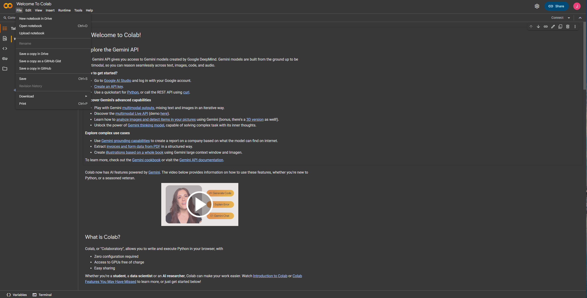
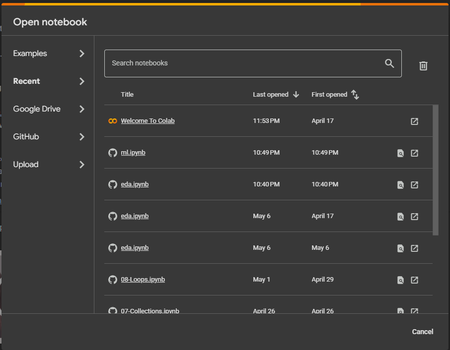
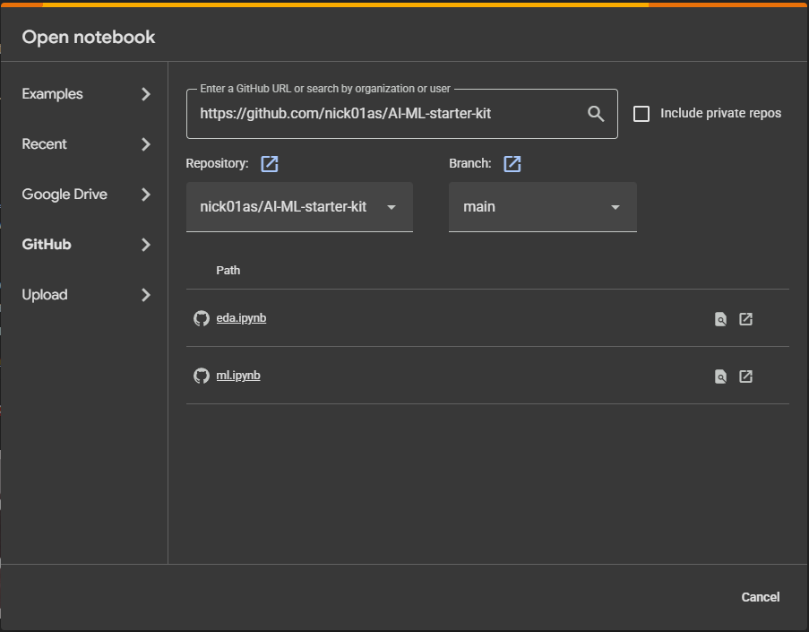
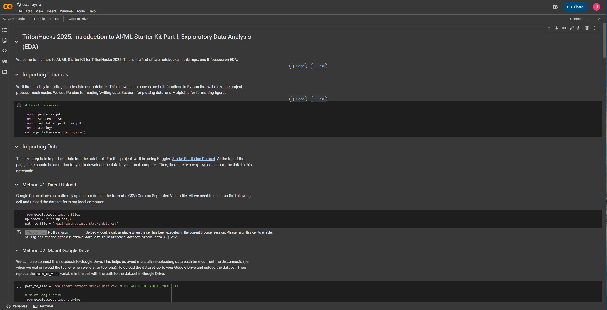

# TritonHacks 2025 AI/ML Starter Kit Repo

Welcome to the AI/ML Starter Kit! This starter kit contains 2 parts: Exploratory Data Analysis (EDA) and Machine Learning (ML). In the first part, we will be building Seaborn- & Matplotlib- powered models (e.g. bar graphs, histograms, scatterplots, boxplots) to help visualize and analyze the relationship between different input features and the stroke-prediction outcome. In the ML part of this project, we will build predictive Scikit-Learn models (KNN, Linear Regression, Random Forests/Decision Trees, MLP Classifier). Both parts are powered by Google Colab.

Below are instructions on how to get started. 

1. Download the `.csv` file called `healthcare-dataset-stroke-data.csv` located in this repository. This dataset was found on Kaggle at https://www.kaggle.com/datasets/fedesoriano/stroke-prediction-dataset. Place it into your Google Drive, under "My Drive". 

2. Go to https://colab.research.google.com/. If you haven’t signed up yet, make one with your Gmail account.

3. Click on “File -> Open Notebook”.

4. You should see a window pop up that looks like this:

5. Click on “GitHub” on the left panel. Search for the AI/ML Starter Kit repo using this link: https://github.com/tritonhacks/TritonHacks2025-ML-starter-kit 

6. Notice that a list of notebooks from the repo will appear. Explore `eda.ipynb` first before looking at `ml.ipynb`. You should be taken to a notebook environment looking something like this:

Now you're ready to go! You can run the blocks of code and text by pressing `Shift`+`Enter`. When you run a code block for the first time, you may get a warning that says: "Warning: This notebook was not authored by Google". Feel free to ignore this and click "Run anyway". 